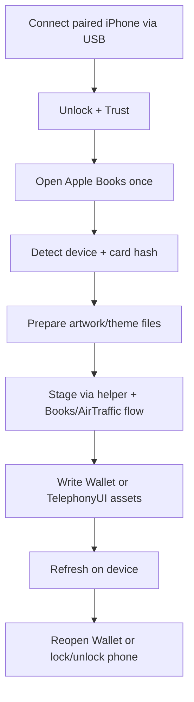

# AirCard macOS

A macOS port of the Apple Wallet card customization flow from [AirCard-Windows](https://github.com/Lumid-Off/AirCard-Windows), maintained in this fork.

> **Status**
> - Experimental project (not an Apple-official tool)
> - Uses private Apple frameworks/APIs
> - Reported tested state in this repo: iPhone18,3 on iOS 27.2 (build 24B5084k)
> - Card-hash detection also supports iOS 18 logs (including 18.7.8)

## What it does

- Detects paired iPhones from macOS.
- Detects Wallet card hashes from device logs.
- Generates and writes Wallet card artwork assets (PNG/PDF variants).
- Can recolor and flash `.passthm` assets for iOS passcode keyboard caches (`TelephonyUI-8/9/10`).
- Includes a layer-based “Card Studio” (`.aircardskin`) with live preview and export.

## Current status

Working scope in this repository:

- Native iPhone detection and Wallet card hash detection.
- Wallet asset writing for canonical names (`cardBackgroundCombined`, `diffuse`, `background`, `strip`) in 3x, 2x, and PDF variants.
- Optional overlays merged in order before writing.
- Passcode theme recolor/write flow with language-aware key naming and `--white/--black` + `-bold` variants.
- Auto cache target selection:
  - iOS 18+ → `TelephonyUI-10`
  - iOS 16–17 → `TelephonyUI-9`
  - older → `TelephonyUI-8`

## Requirements

- macOS **14+**
- Swift **6.2** toolchain (`Package.swift`)
- Apple command-line build tools (`xcrun`, `clang`, `codesign`, `hdiutil`, etc.)
- A paired iPhone connected over USB (unlock + trust prompt accepted)

## Quick start

From `/home/runner/work/AirCard-macOS/AirCard-macOS`:

```sh
chmod +x Scripts/build_helpers.sh
Scripts/build_helpers.sh
swift run
```

Build a universal `.app`:

```sh
chmod +x Scripts/build_app.sh
Scripts/build_app.sh
open build/AirCardMac.app
```

Build a `.dmg` installer too:

```sh
chmod +x Scripts/build_dmg.sh
Scripts/build_dmg.sh
open build/AirCardMac.dmg
```

## How the workflow works



### Wallet card artwork flow

1. Detect card hash (or paste manually).
2. Choose artwork and optional transparent PNG overlays.
3. Apply skin.
4. Reopen Wallet on iPhone.

### Keyboard theme flow (`.passthm`)

1. Select theme package and color.
2. Choose variant/language/bold options.
3. Apply keyboard color to `TelephonyUI-*` cache.
4. Lock the iPhone so TelephonyUI reloads cache.

## Card Studio and features

- Layered card editor (`.aircardskin`) with Core Image + runtime-compiled Metal shaders.
- Layer types include image, color, gradients, holographic/metal effects, grain/patterns, and text.
- Blend modes, opacity, and global post-processing controls.
- Undo/redo, drag-and-drop, save/reopen designs.
- Applied designs are stored under:
  - `~/Library/Application Support/AirCard/Cards/<hash>/`

## Card artwork vs keyboard theme (quick comparison)

| Area | Card artwork flow | Keyboard theme flow |
|---|---|---|
| iPhone target | `/var/mobile/Library/Passes/Cards/...` | `/var/mobile/Library/Caches/TelephonyUI-8/9/10` |
| Input | Base image + optional overlays | `.passthm` package |
| Output assets | `cardBackgroundCombined`, `diffuse`, `background`, `strip` (PNG/PDF variants) | Recolored key PNG variants (`--white/--black`, optional `-bold`) |
| User action after write | Close/reopen Wallet | Lock iPhone to refresh cache |
| Known control limits | Number color may still be controlled by iOS/issuer | Depends on cache/version + selected naming variants |

## Limitations

- The app cannot reliably read full original Wallet card artwork; write path is the main supported path.
- Original issuer/Apple design backup is not guaranteed by this tooling.
- To restore original card visuals, remove and re-add the card in Wallet.
- Dynamic motion effects are rendered by iOS; written assets are static images.
- `pass.json` text color edits are experimental and may be ignored or rejected by iOS.

## Safety and trust notes (practical security review)

**Reviewed on:** 2026-09-27 (repository-level spot review of README claims, `Scripts/*.sh`, `Sources/Native/*.m`, and Wallet/keyboard write services).

This project should be treated as **high risk / experimental tooling**:

- It uses **private Apple frameworks** (`MobileDevice.framework`, `AirTrafficHost.framework`).
- It can **modify files on a connected iPhone**, including Wallet card paths and TelephonyUI cache paths.
- It is **not Apple-official** and is not presented here as notarized production software.
- Build scripts use **ad-hoc signing** (`codesign --sign -`), which is not notarization.

Observed code-level notes from the reviewed files:

- No obvious hardcoded API keys or credentials were found in reviewed source/build files.
- No obvious external download/update flow was found in reviewed app source (no `URLSession`/HTTP fetch path observed).
- Native helper code includes path checks for `pass.json` reads and limits some generated cleanup scope, but it still performs privileged write/remove operations inside iPhone AFC/AirTraffic flows.

**Operational guidance:**

- Test only on a **secondary/disposable device**.
- Keep current backups and be ready to restore.
- Expect breakage across iOS updates.

## Troubleshooting

- **Device not detected:** reconnect USB, unlock iPhone, accept trust prompt, then retry.
- **Write stalls/fails:** open Apple Books once before first flash; keep device unlocked during write.
- **Wallet changes not visible:** close and reopen Wallet.
- **Keyboard changes not visible:** lock/unlock iPhone after applying theme.
- **AirTraffic timeout:** unlock device and retry (timeout scales with file count).

## Fork, lineage, and credits

- This repository is a public fork of `alejadxr/AirCard-macOS`.
- The project lineage references `Lumid-Off/AirCard-Windows` as upstream flow inspiration.
- License in this repository: [MIT](./LICENSE).

## Language support in app UI

- Spanish
- Portuguese (Brazil, `pt-BR`)

To set AirCard language only: **System Settings → General → Language & Region → Applications**.
